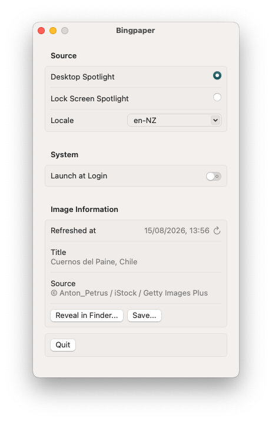

# Bingpaper

Use Bing/Windows Spotlight's images on macOS, without needing to use the [Bing Wallpaper](https://bingwallpaper.microsoft.com/Windows/bing/bing-wallpaper/) app.

Bingpaper uses the same API as Windows Spotlight.

## Screenshot

## AI Use Disclosure
LLM-generated code has been used in this project. As with all projects I create:
- All READMEs are human written: If I didn't bother to write it, you probably won't be bothered to read it :^)
- I disclose when LLM-generated code or documentation has been used.
- All code and software functionaly is personally reviewed by me.
  - This doesn't mean the software comes with a guarantee.
  - For small quick projects, I take a "good enough" approach to avoid spending too much time on one thing.
- My own personal software developement experience is used to direct the output of LLM-generated code.
  - This encourages the use of correct patterns, succinct code, while not over-engineering a solution.
- This is free and open-source software designed to solve a problem, do whatever you like with it.
